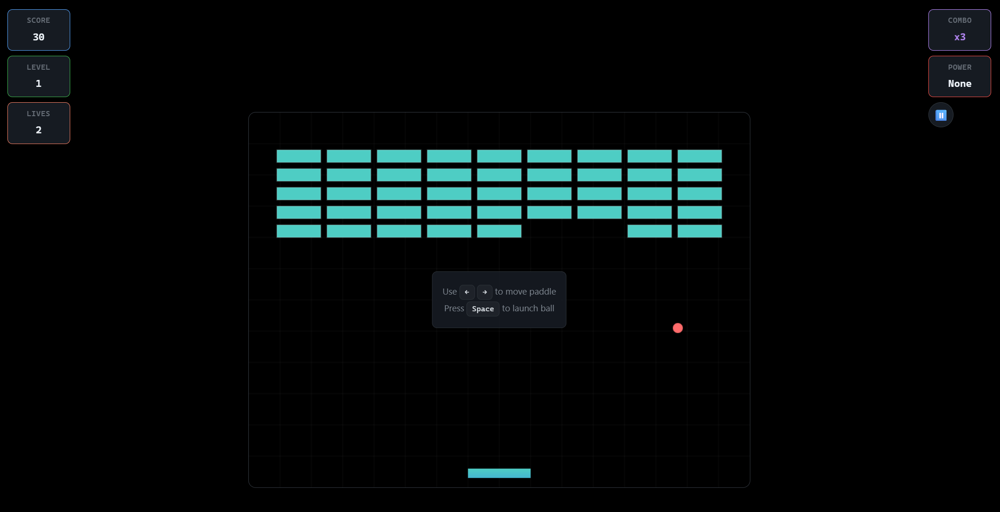

# 🎮 Bounce Breaker

A classic brick breaker game built with HTML5 Canvas and JavaScript. Features modern UI design, power-ups, particle effects, and responsive gameplay.



## 🚀 Live Demo

**[Play Online](https://ayeshatasnim15.github.io/Bounce-Breaker/)**

## ✨ Features

### Gameplay
- **Classic Brick Breaker** - Intuitive paddle and ball physics
- **Power-up System** - Multi-ball, paddle size, speed boost, laser, extra life
- **Multiple Brick Types** - Normal, strong, explosive, moving, and indestructible
- **Combo System** - Score multipliers for consecutive hits
- **4 Difficulty Levels** - Easy, Normal, Hard, Expert
- **Progressive Levels** - Increasingly challenging gameplay

### Visual & UI
- **Modern Dark Theme** - Cursor/ChatGPT-inspired design
- **Particle Effects** - Explosion animations for brick destruction
- **Smooth Animations** - 60fps gameplay with fluid transitions
- **Responsive Design** - Perfect on mobile, tablet, and desktop
- **Professional Menus** - Settings, high scores, pause system

### Technical
- **HTML5 Canvas** - Hardware-accelerated 2D graphics
- **JavaScript ES6+** - Modern classes and object-oriented design
- **CSS3 Animations** - Smooth transitions and effects
- **localStorage** - Persistent high score system
- **Cross-Browser** - Works on Chrome, Firefox, Safari, Edge

## 🎮 How to Play

### Controls
- **Arrow Keys** - Move paddle left/right
- **Spacebar** - Launch ball (when attached to paddle)
- **Pause Button** - Pause/resume game

### Objective
1. Break all bricks to complete each level
2. Keep the ball from falling below the paddle
3. Collect power-ups for special abilities
4. Build combos for higher scores
5. Progress through increasingly difficult levels

### Scoring
- **Base Score** - 10 points per brick
- **Combo Multiplier** - Up to 10x for consecutive hits
- **Time Bonus** - Extra points for quick level completion

## 🛠️ Technologies

- **HTML5** - Semantic markup and Canvas API
- **CSS3** - Custom properties, animations, responsive design
- **JavaScript ES6+** - Classes, modules, modern syntax
- **Canvas API** - 2D graphics and game rendering

## 📦 Installation

### Quick Start
```bash
# Clone the repository
git clone https://github.com/yourusername/bounce-breaker.git

# Navigate to project directory
cd bounce-breaker

# Start local server
python -m http.server 8000
# or
npx serve .

# Open in browser
open http://localhost:8000
```

## 🏗️ Project Structure

```
bounce-breaker/
├── index.html          # Main HTML file
├── style.css           # Styles and responsive design
├── script.js           # Game logic and mechanics
├── image.png           # Game screenshot
├── README.md           # Project documentation
└── .gitignore          # Git ignore file
```

## 🎯 Game Classes

- **GameManager** - Main game controller and state management
- **GameState** - Centralized game state handling
- **Ball** - Ball physics and rendering
- **Paddle** - Paddle controls and power-up system
- **Brick** - Brick types and collision detection
- **PowerUp** - Power-up system and effects
- **Particle** - Particle system for visual effects

## 📱 Responsive Design

- **Mobile** (320px+) - Touch controls and mobile-optimized UI
- **Tablet** (768px+) - Hybrid touch and keyboard controls
- **Desktop** (1024px+) - Full keyboard and mouse support
- **Large Screens** (1440px+) - Optimized for high-resolution displays

## 🚀 Performance

- **60fps Gameplay** - Smooth animations and responsive controls
- **Memory Management** - Efficient object pooling and cleanup
- **Canvas Optimization** - Minimal redraws and efficient rendering
- **Fast Loading** - Optimized assets and lazy loading

## 🤝 Contributing

1. Fork the repository
2. Create a feature branch (`git checkout -b feature/amazing-feature`)
3. Commit your changes (`git commit -m 'Add amazing feature'`)
4. Push to the branch (`git push origin feature/amazing-feature`)
5. Open a Pull Request

## 📄 License

This project is licensed under the MIT License.

## 🙏 Acknowledgments

- HTML5 Canvas API for 2D graphics capabilities
- Modern CSS for responsive design
- JavaScript community for documentation and examples

---

**Built with ❤️ using HTML5 Canvas & JavaScript**